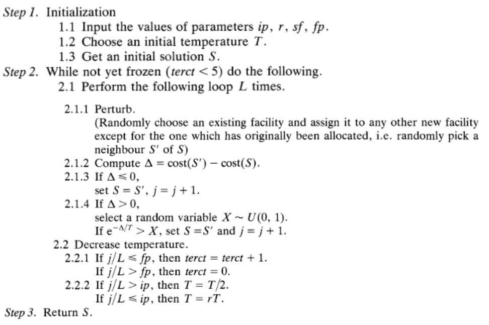

# Simulated Annealing Application on Generalized Assignment Problem

This implementation of Simulated Annealing has various parameters. You can choose best parameters using parameterSelection function amoung given set of parameters.

By adjusting "minim" parameter of simulatedAnnealing function you can either use it for minimization or maximization.

making "fast" parameter "true" in simulatedAnnealing function changes the neighborhood from best improvement to random selection.

For both parameterSelection and simulatedAnnealing "verbose" parameter shows each solution generated per iteration. Using "summary" parameter you can only print the last results and summary of the algorithm run.

